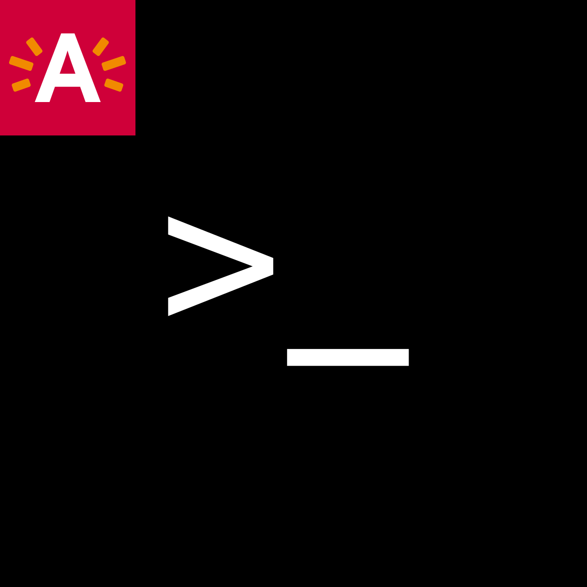

[](https://travis-ci.com/digipolisantwerp/authz_module_nodejs)
[](https://coveralls.io/github/digipolisantwerp/authz_module_nodejs?branch=master)
[](https://badge.fury.io/js/%40digipolis%2Fauthz)

**npm:** [npmjs.com/package/@digipolis/log](https://www.npmjs.com/package/@digipolis/log)
# @digipolis/log


Log helper which converts default logs to indexable json log.


### Table of contents:

<!--ts-->
   * [Installing](#installing)
      * [npm](#npm)
      * [Yarn](#yarn)
   * [Configuration](#configuration)
   * [Logging](#logging)
   * [Running the tests](#running-the-tests)
   * [Versioning](#versioning)
   * [Authors](#authors)
   * [License](#license)
<!--te-->

## Spec
[https://github.com/digipolisantwerpdocumentation/logging-requirements](https://github.com/digipolisantwerpdocumentation/logging-requirements)
## Installing

#### npm:
```sh
$ npm i @digipolis/log
```

#### Yarn:
```sh
$ yarn add @digipolis/log
```

## Configuration

##### Params:
| Param                   | Description        | Values                                  |
| :---                    | :---               | :---                                    |
| ***type*** *(optional)* | Set logging mode   | **log**(default) / **json** / **text**  |

##### Example:
```javascript
const digipolisLogger = require('@digipolis/log');

digipolisLogger(console, {
  type: 'text', // log | json | text
});

// human readable for local development
console.log('hello');
/*
type: 'text' -> INFO: 2021-12-01T09:43:19.173Z hello
*/

// human readable json local development
console.log('hello');
/*
type: 'json' -> {
  message: 'hello',
  timestamp: '2021-12-01T09:44:20.565Z',
  type: [ 'technical' ],
  level: 'INFO',
  correlationId: ''
}
*/

// log for kibana json for production
console.log('hello');
/*
type: 'log' -> {"message":"hello","timestamp":"2021-12-01T09:45:56.515Z","type":["technical"],"level":"INFO","correlationId":""}
*/

```

## Logging

#### Examples
```javascript

// type: json
console.log('hello');
/*
{
  message: 'hello',
  timestamp: '2021-12-01T09:44:20.565Z',
  type: [ 'technical' ],
  level: 'INFO',
  correlationId: ''
}
*/

// type: json
console.error('hello');
/*
{
  message: 'hello',
  timestamp: '2021-12-01T09:44:20.565Z',
  type: [ 'technical' ],
  level: 'ERROR',
  correlationId: ''
}
// type: json
*/

console.error(new Error('Errormessage'));
/*
{
  message: 'Errormessage Error: Errormessage\n' +
    '    at Object.<anonymous> (/Users/oliviervandenmooter/Projects/Digipolis/diglog/example/index.js:17:13)\n' +
    '    at Module._compile (node:internal/modules/cjs/loader:1095:14)\n' +
    '    at Object.Module._extensions..js (node:internal/modules/cjs/loader:1124:10)\n' +
    '    at Module.load (node:internal/modules/cjs/loader:975:32)\n' +
    '    at Function.Module._load (node:internal/modules/cjs/loader:816:12)\n' +
    '    at Function.executeUserEntryPoint [as runMain] (node:internal/modules/run_main:79:12)\n' +
    '    at node:internal/main/run_main_module:17:47',
  timestamp: '2021-12-01T11:00:13.073Z',
  type: [ 'technical' ],
  level: 'ERROR',
  correlationId: ''
}
*/

// structured message
console.log({ message: 'logmessage2', timestamp: 'timestamp123' })
/*
{
  message: 'logmessage2',
  timestamp: 'timestamp123',
  type: [ 'technical' ],
  level: 'INFO',
  correlationId: ''
}

// structured message with extra params
*/
console.log({ message: 'logmessage2', timestamp: 'timestamp123', extra_param1: "extra_value" });

/*
{
  message: 'logmessage2 Extrainfo: {"extra_param1":"extra_value"}',
  timestamp: 'timestamp123',
  type: [ 'technical' ],
  level: 'INFO',
  correlationId: ''
}
*/
```

